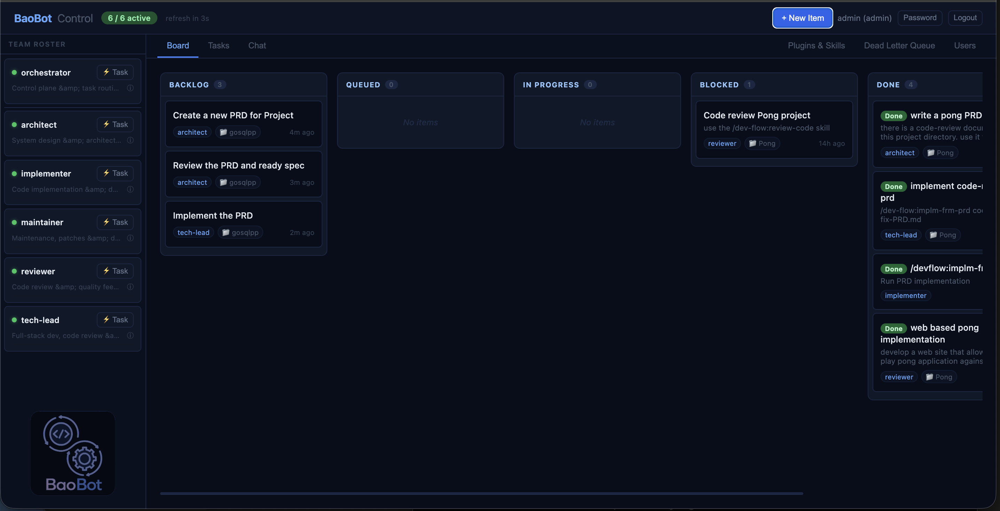

# BaoBot Dev Team



A system of cooperative, always-on AI agents that function as a software development team. Each agent carries a specialised role, its own evolving memory, and the ability to communicate with teammates — forming a self-coordinating unit that responds to commands, reacts to events, and completes complex work autonomously.

"Bao" (เบา) is the Thai word for servant or helper.

## Modules

| Module | Description |
|---|---|
| [`boabot/`](boabot/) | Agent runtime — local single-binary process, no cloud account required |
| [`boabotctl/`](boabotctl/) | Operator CLI — communicates with the orchestrator via REST API |
| [`boabot-team/`](boabot-team/) | Bot personalities and configurations |

## Documentation

- [`docs/product-summary.md`](docs/product-summary.md) — system overview
- [`docs/product-details.md`](docs/product-details.md) — full feature and product specification
- [`docs/technical-details.md`](docs/technical-details.md) — system architecture and infrastructure
- [`docs/architectural-decision-record.md`](docs/architectural-decision-record.md) — key decisions and their rationale
- [`docs/viability-recommendation.md`](docs/viability-recommendation.md) — agent team viability assessment and measurement protocol

## User Documentation

- [`user-docs/getting-started.md`](user-docs/getting-started.md) — connect to a running BaoBot team as an operator
- [`boabot/user-docs/getting-started.md`](boabot/user-docs/getting-started.md) — self-host a local BaoBot team from source
- [`boabot/user-docs/configuration.md`](boabot/user-docs/configuration.md) — boabot configuration reference
- [`boabot/user-docs/orchestrator.md`](boabot/user-docs/orchestrator.md) — orchestrator mode guide
- [`boabotctl/user-docs/baobotctl.md`](boabotctl/user-docs/baobotctl.md) — operator CLI reference

## Development

See [`AGENTS.md`](AGENTS.md) for coding standards and [`CLAUDE.md`](CLAUDE.md) for Claude Code guidance.

### Prerequisites

- Go 1.26+
- `golangci-lint` installed (`brew install golangci-lint` on macOS)
- An Anthropic API key (`ANTHROPIC_API_KEY`) for the default model provider

### Build

```bash
cd boabot && go build -o bin/boabot ./cmd/boabot
cd boabotctl && go build -o bin/boabotctl ./cmd/boabotctl
```

### Test

```bash
cd boabot && go test -race -coverprofile=coverage.out ./...
cd boabotctl && go test -race -coverprofile=coverage.out ./...
```

### Lint

```bash
cd boabot && golangci-lint run
cd boabotctl && golangci-lint run
```

## Full Specification

See [`PRODUCT.md`](PRODUCT.md) for the complete product specification.
